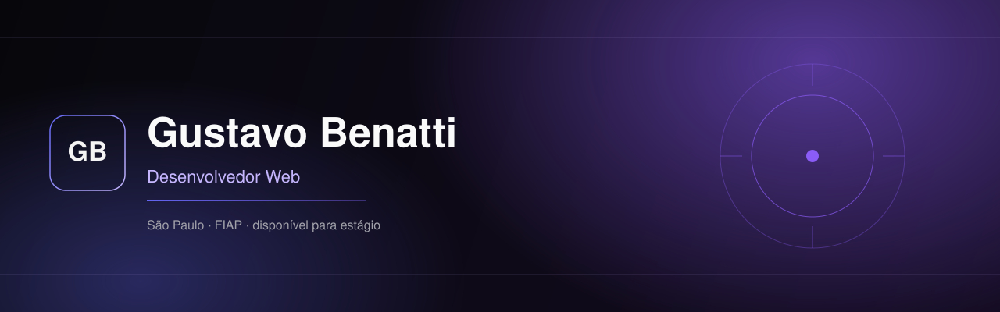

### Sobre

Interfaces, catálogos e assistentes de IA que rodam na máquina. Técnico em Desenvolvimento de Sistemas pela Etec Sebrae e estudante de Sistemas de Informação na FIAP.

### Stack

### Atividade

